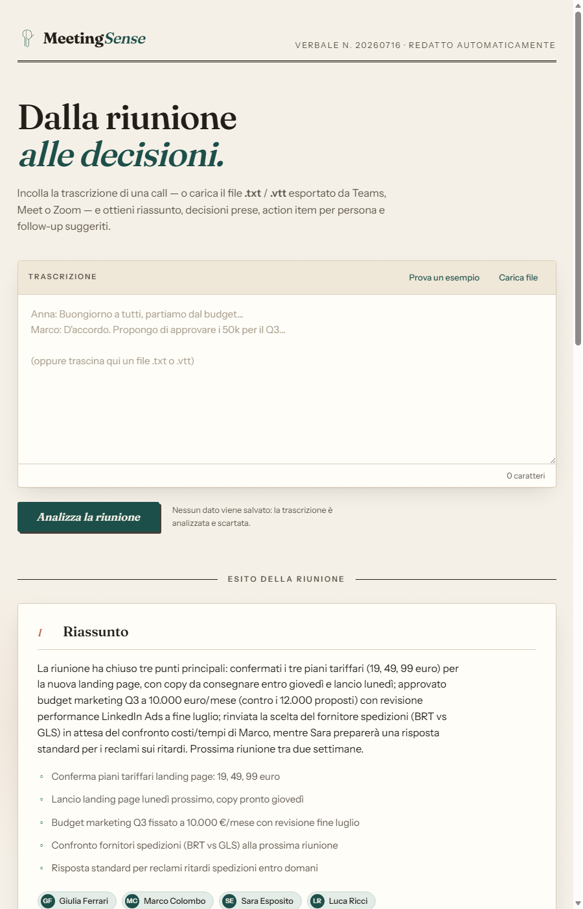

# MeetingSense

**Dalla riunione alle decisioni, automaticamente.**

MeetingSense è un assistente che trasforma la trascrizione di una call aziendale (Teams, Meet, Zoom o qualsiasi testo) in un verbale strutturato e pronto da condividere: cosa è stato deciso, chi deve fare cosa, quali rischi sono emersi e quali domande restano aperte — senza dover riascoltare o rileggere l'intera riunione.

**🔗 Prova la demo: [meeting-sense-gray.vercel.app](https://meeting-sense-gray.vercel.app/)**

## Cosa estrae

- 📝 **Riassunto** con punti chiave e partecipanti
- ✅ **Decisioni prese**
- 👤 **Action item assegnati per persona**, con eventuale scadenza
- 🔁 **Follow-up suggeriti** per la prossima riunione
- ⚠️ **Rischi e blocker** emersi durante la discussione
- ❓ **Domande rimaste senza risposta**
- 📊 **KPI e metriche citate** (budget, date, percentuali, obiettivi) in una tabella
- 📋 Un bottone per **copiare tutto come Markdown** e incollarlo in email, Slack o Notion

## Come usarlo

1. Incolla il testo della trascrizione (o carica un file `.txt`/`.vtt`) nella pagina.
2. Clicca "Analizza la riunione".
3. Dopo pochi secondi ottieni il verbale completo, pronto da leggere o esportare.

Nessun dato viene salvato: la trascrizione è analizzata al volo e scartata.

## Stack tecnico

- **Backend**: [FastAPI](https://fastapi.tiangolo.com/) (Python)
- **Estrazione strutturata**: LLM gratuito via [OpenRouter](https://openrouter.ai)
- **Frontend**: pagina statica in HTML/CSS/JavaScript, senza framework
- **Deploy**: [Vercel](https://vercel.com)

Per eseguirlo in locale, contribuire o deployarlo, vedi [CONFIGURATION.md](CONFIGURATION.md).

## Stato del progetto

MeetingSense è un MVP in fase di test pubblico. Feedback e segnalazioni sono benvenuti.
